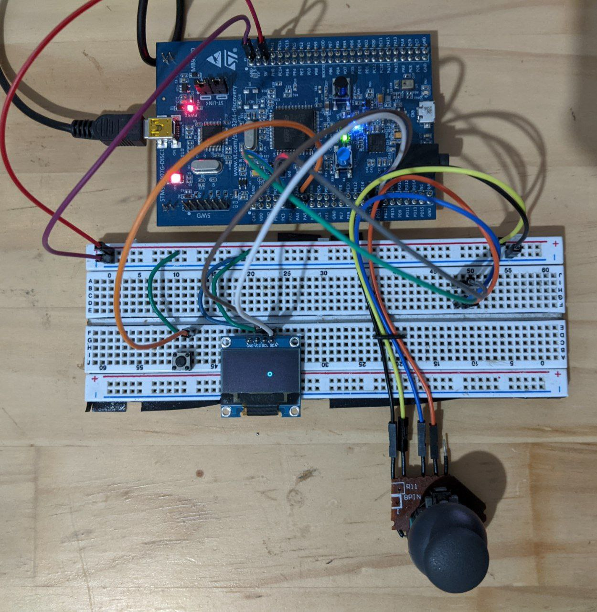

# Basic Draw

Projecto para el curso de sistemas embebidos 2022

El joystick mueve el cursor en la pantalla en diferentes velocidades.
Cuando se mantiene presionado el boton el cursor pinta su recorrido.
Cuando el boton no esta presinado y el cursor pasa sobre un area pintada esta area se borra.

Hardware:
- Tarjeta STM32F4-Discovery con MCU STM32F407VG
- OLED display SSD1306 (128x64)
- Joystick analogico
- Boton

