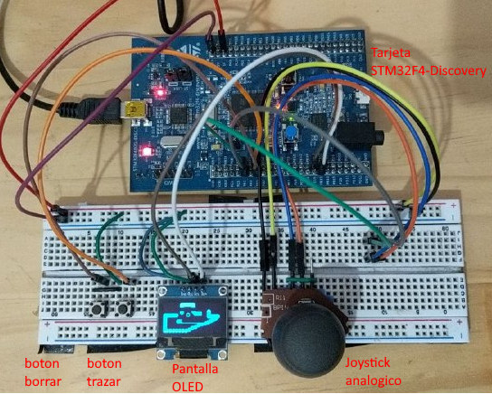

# Basic Draw

## Descripcion

Projecto para el curso de sistemas embebidos 2022

El joystick mueve el cursor en la pantalla.

Mantener el boton de pintar presionado hace que el cursor pinte su recorrido o posicion.

Mantener el boton de borrar presionado hace que el cursor borre su recorrido.

## Hardware:
- Tarjeta STM32F4-Discovery con MCU STM32F407VG
- OLED display SSD1306 (128x64)
- Joystick analogico
- Botone de trazar y borrar

## Software:

- STM32CubeIDE v1.17 con CubeMX 6.3
- Aplicacion en C/C++
- Usando HAL en el firmware [STM32CubeF4 v1.26.2]( https://github.com/STMicroelectronics/STM32CubeF4/tree/v1.26.2)

# Demo

https://www.youtube.com/watch?v=K4nM4ibx1SE

